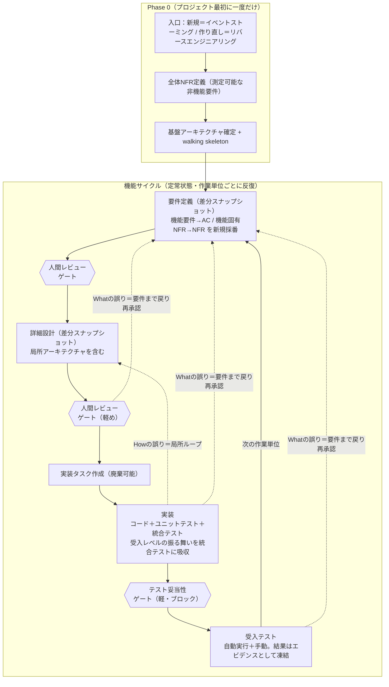

# SDD（仕様駆動開発）全体フロー

このドキュメントは壁打ち（003〜008）で確定した方針を1枚に統合したもの。個別の根拠は各壁打ちドキュメントを参照。

## 貫く背骨（最重要の前提）

1. **現在のシステムの真実は「ソース＋ユニットテスト＋統合テスト」だけ。** 要件定義・詳細設計・受入シナリオは、作業単位ごとの差分スナップショット（追記ログ）であって、最新の全体状態を維持するものではない。（→ 07 ドキュメント管理方針）
2. **作業単位は小さく保つ。** 1つの小さな機能 = 1ブランチ = 1 PR。手戻りが起きてもAI実装は数時間で完了できる規模に。（→ 03 手戻りポリシー）
3. **追跡はプレーンテキストIDと全文検索だけに依存する。** Obsidian・Git・CIは任意の便利機能で、無くても成立する。（→ 04 トレーサビリティ）
4. **回帰の安全網（ユニット/統合テスト）を常に高精度に保つことが、全体の安全条件。**

## 全体像

> Whatの誤り（受入テストが変わる誤り）は受入テスト（B5）だけでなく、設計ゲート（G2）や実装（B4）でも露見しうる。どこで気づいても遡り先は要件定義（B1）で一つ＝要件まで戻って人間が再承認する。図の点線はその手戻り経路を網羅的に示す。

## Phase 0（プロジェクト最初に一度だけ）

小さな機能サイクルを回す前に、一度だけ土台を作る。（→ 06 アーキテクチャと非機能要件）

| 工程 | やること | 成果物 |
|---|---|---|
| 入口 | 新規：イベントストーミングでドメインを深掘り／作り直し：既存資産からリバースエンジニアリング | イベストボード（凍結）／現行システム仕様書（凍結） |
| 全体NFR定義 | 性能・可用性・セキュリティ等の測定可能な目標を決める | NFR（測定可能なものは `NFR-arch-<n>` へ。検証は負荷試験/監視/診断の別トラック → 11） |
| 基盤アーキテクチャ確定 | 技術スタック・レイヤ/モジュール境界・横断的関心事（認証・エラー処理・ログ・トランザクション・API規約）を決め、walking skeletonを作る | アーキテクチャ概要（**living**・維持する）＋基盤ADR群 |

順序は **NFR → アーキテクチャ**（アーキはNFRを満たすために存在する）。基盤アーキの変更は多数の作業単位に波及する re-baseline。

## 機能サイクル（定常状態）

以降はすべてこの小さなサイクルの反復。**新規開発の途中も保守も、本質的にこの同じサイクル。**（→ 08 保守開発）

### 1. 要件定義（差分スナップショット）
- その作業単位で「現状にどう機能を追加/改善するか」を記述。機能要件＋機能固有の測定可能NFR。
- 検証可能な受入基準を **AC-IDを新規採番**して定義し、`.feature`（Gherkin記法）に起こす。（→ 05 受入テストのフォーマット）
- 機能固有の測定可能NFRは **`NFR-<slug>-<n>` で別採番**し `@NFR-<slug>-<n>` タグで書く。検証は機能回帰網ではなく負荷試験/監視/診断の別トラック（→ 11 NFR検証ライフサイクル）。
- **人間レビューゲート（重点）**：ここを人間がしっかり見る。

### 2. 詳細設計（差分スナップショット）
- 要件とACをもとにAIが設計。局所アーキテクチャ（この作業に閉じる構造）はここで決める。
- 設計判断（Why）はADRに記録（不変・supersedeで追記）。
- **人間レビューゲート（軽め）**：的外れやインフラ影響を軽く確認。

### 3. 実装タスク作成（廃棄可能）
- 実装タスク一覧を作成。作業中の作業記憶であり、マージ後はHEADから消す。
- ここは重厚なレビューをしない（人間は受入テストと設計の妥当性に集中）。

### 4. 実装
- タスクをもとにコードを実装。ユニットテスト・統合テストを実装。
- **受入レベルの振る舞いは統合テストに吸収し、恒久的な回帰網とする**（07の絶対条件）。`.feature`のACは `test_AC_xxx` としてlivingテストに紐づける。
- 設計に問題があれば詳細設計へ戻る（Howの局所ループ）。

### 4b. テスト妥当性ゲート（軽め・ブロック）
- モデル全体は「living統合テストが振る舞いを本当にカバーしていること」に全体重が乗る（07の唯一かつ最大の条件）。しかしテストの**存在**は追跡できても**中身**は自動では見えない。ここで回帰網の中身を検査する。（→ 10 テスト妥当性ゲート）
- `sdd-test-reviewer` が `.feature` と実テストコードを突き合わせ（実行しない）、空虚なテスト・**期待値が実装由来（curve-fitting）**・シナリオ網羅の穴・弱いアサーションを検出。
- 核心：**テストの期待値が `.feature`（人間承認済みのWhat）由来か、実装の出力から逆算されていないか**。実装のバグをテストが「正」としてしまう事故を防ぐ最終防衛線。
- **人間レビューゲート（軽め）**：疑わしい箇所＋AC単位のスポットチェック。trace（非ブロック）と違い、生命線なのでここは通過必須。

### 5. 受入テスト
- 自動実行できるものは自動、手動操作が必要なものは人間が実施。
- 結果はエビデンスとして**凍結スナップショット**で保存。
- PRを仕上げる前に **trace を必須ステップとして実行**する（回帰網を守る唯一の機械チェックなので省略不可）。実行は必須だが結果はブロックしない＝非ブロック方針は維持し、差分は報告する。

## 手戻りポリシー（→ 03）

レビューゲートを「コミットポイント」とみなす。**未通過の成果物は自由に手戻り、通過済みに遡るときはそのゲートを再通過させる。**

| エラーの所在 | 遡り先 | 判定基準 |
|---|---|---|
| **Howの誤り**（設計・タスク・コードが誤り。要件は正しい） | 誤った成果物まで（局所ループ） | 受入テストが変わらない |
| **Whatの誤り**（要件・受入仕様が誤り） | 要件定義まで戻り人間が再承認 → 下流を再導出 | 受入テストが変わる |

- **要件定義までの手戻りは、例外ではなく想定された正規ルート。**
- 原則その場で直しきる（作業単位が小さいのでコード先行は作らない）。
- **意図的な簡略化**：03 には「いつ直すか」に *即時停止（fail fast）* と *チケット化して次のチェックポイントでまとめて修正* の分岐があるが、本フローは前者（原則その場で直しきる）のみを採用し、後者の分岐は実装しない。作業単位を小さく保つ（背骨2）ことでコード先行状態がほぼ生じない前提に立った割り切りであり、分岐を省いた事実は認識しておく。まとめ修正が必要になるほど作業単位が大きい場合は、まず作業単位の分割を見直す。

## トレーサビリティ（→ 04）

- 背骨のID（**名前空間付き** `<PREFIX>-<slug>-<n>`）：`REQ-<slug>-<n>`（要件）/ `AC-<slug>-<n>`（受入基準・実質の背骨）/ `NFR-<slug>-<n>`（測定可能な非機能要件・検証トラックが別。Phase0全体は `NFR-arch-<n>`）/ `ADR-<slug>-<n>`（Why）。`<slug>` は作業単位ディレクトリ `units/<slug>/` の名、`<n>` はunitローカル連番。**変更時はsupersede。**
- IDはプレーンテキストで各成果物の本文に埋める。下流が上流IDを宣言し、逆方向は全文検索で得る。
- **現在有効なAC ＝ living統合テスト網が現在参照しているAC-ID。** supersede後は要件/.featureに旧IDがスナップショットとして残るため、全文検索は生死を混在で返す。生きている集合はテスト網（`test_AC_`）が担ぐIDで確定する。前方影響分析は「grepで候補を広く集める → テスト網で生きた範囲を絞る」の2段で読む（NFRは `NFR-<slug>-<n>` で別採番・回帰網外なのでこの導出の対象外。→ 11 NFR検証ライフサイクル）。
- **採番はunitローカル連番。** repo全体のmax+1検索は不要（`<slug>` が名前空間）。同slugは `units/<slug>/requirements.md` の同一パス競合として git がサーバ側マージでも検出するので、並行ブランチの採番衝突は構造的に起きず、マージ時の振り直しもCI強制も不要（→ 12 採番の衝突と直列化）。
- `.feature`は `@REQ-checkout-1 @AC-checkout-3` タグ、テストは `test_AC_checkout_3_...`、ソースは判断箇所に `// ADR-checkout-1`。
- 台帳（マトリクス）は検索で再生成できるキャッシュであり、正本ではない。

## ドキュメントのライフサイクル（→ 07）

| 区分 | 中身 | 扱い |
|---|---|---|
| **現在の真実（living/自己検証）** | ソース, ユニットテスト, 統合テスト | HEADが真実。常に高精度に保つ |
| **living（小さな例外・散文）** | 基盤アーキテクチャ概要 | 維持。発見的チェックで腐り検知 |
| **スナップショット/追記ログ（不変）** | 要件定義, 詳細設計, .feature(作成時), 受入テスト結果, イベストボード, 現行システム仕様書, ADR | write-once。作成時点の記録 |
| **廃棄可能** | 実装タスク, 開発レポート | 作業中のみ。マージ後HEADから消す |

- 管理3原則：**co-location（コードと同居）／atomic co-change（1機能=1PRに全部）／性質別ライフサイクル**。
- Gitは実装手段であり依存はしない。
- 「現在の全体仕様書」は維持せず、必要時にコード＋テストからAIで**再生成**する。

## 保守開発（→ 08）

**保守＝SDDの定常状態。** 分岐は次の2つだけ：

- **SDD生まれのシステム**：普通の機能サイクルと完全に同一。テスト網が保守を安全にする。v1後こそSDDの本領。
- **レガシー（テスト網なし）**：触る箇所にまず characterization test を書いて現状の振る舞いを固定（AC採番）→ その網の下で変更（stranglerパターン）。全面作り直しは不要。触った所から網が育ち、時間とともにSDD生まれの状態へ収束する。

保守の変更タイプ（機能追加／振る舞い変更／リファクタ／バグ修正）はすべて 03・04・07 の道具に載り、新しい方法論を必要としない。

## 参照

- [[003_手戻りポリシー]]
- [[004_トレーサビリティ]]
- [[005_受入テストのフォーマット]]
- [[006_アーキテクチャと非機能要件]]
- [[007_ドキュメント管理方針]]
- [[008_保守開発]]
- [[010_テスト妥当性ゲート]]
- [[011_NFR検証ライフサイクル]]
